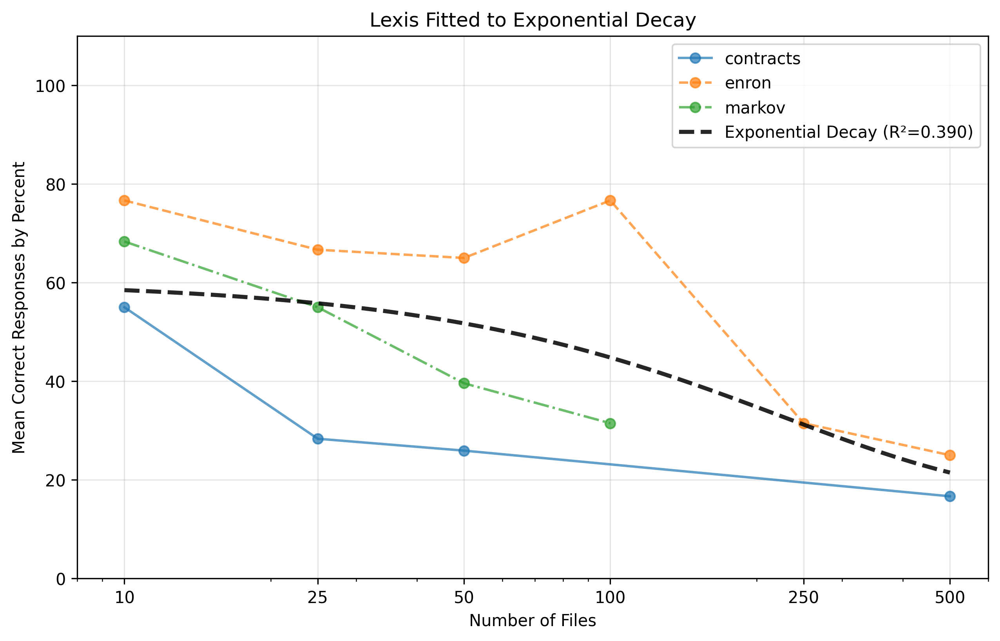
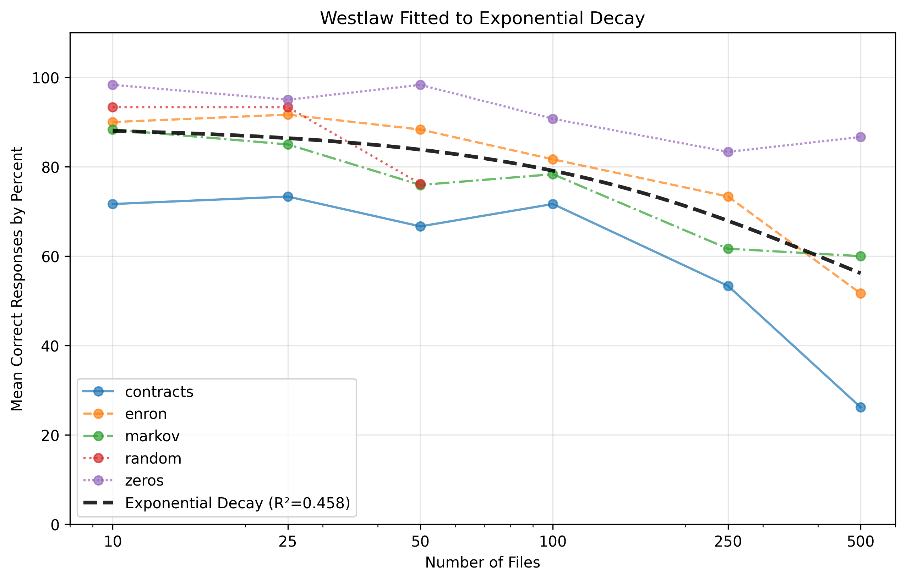
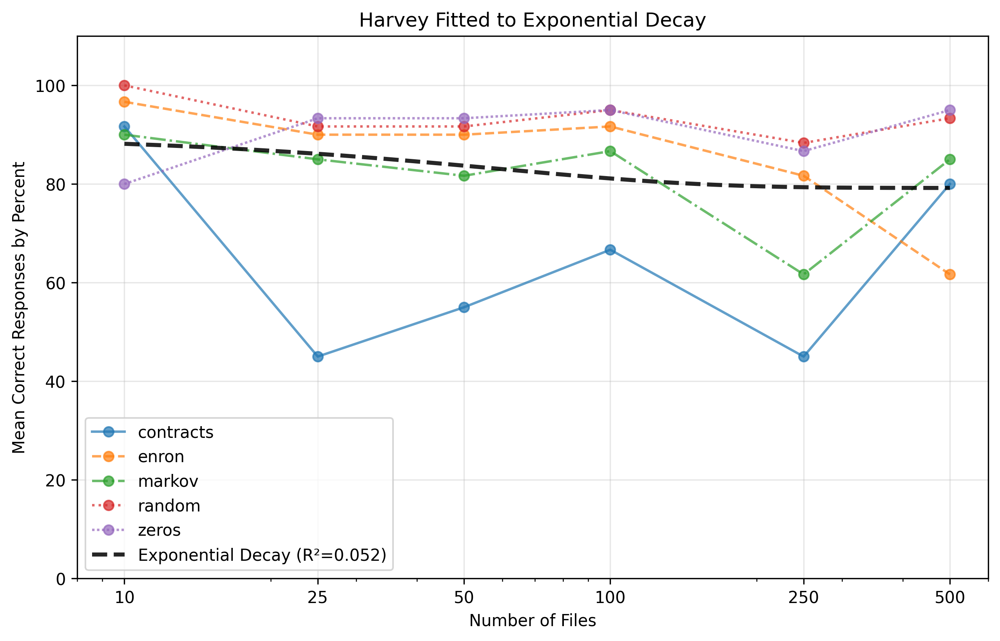
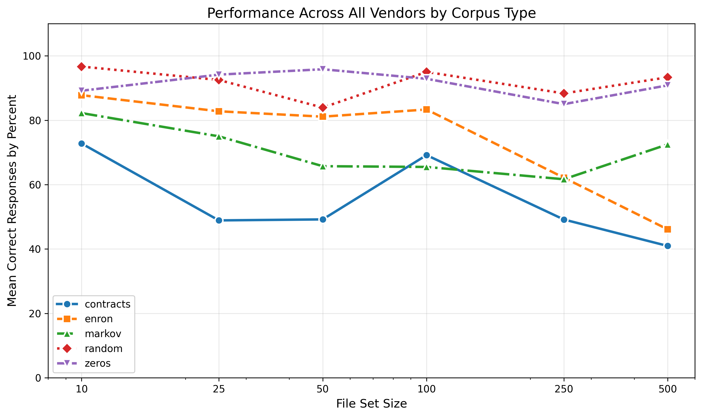

[^18]: Transactional Practice Innovation Lead at Jackson Walker LLP. The author holds a J.D. from the University of Texas School of Law, MSLIS from the University of Illinois, and a BA from Boston College.

# Abstract

Legal technology vendors increasingly offer products that let users upload documents as a custom database and query them via AI chat. This study evaluates the performance of legal AI tools from Westlaw, Lexis, and Harvey with different kinds and sizes of uploaded text. I create a standardized set of files, seed "clues" in them, and ask corresponding questions covering a range of retrieval and logic tasks, grading each tool's ability to retrieve the seeded information. I find correlations between file set size and performance for all tested products, and between corpus type and performance for all tested products. This research aims to give users of legal AI tools data to critically assess these tools and make informed decisions.

# Key Terms

Legal Research, Artificial Intelligence, Empirical Data, Database Retrieval

# Submissions and Declarations

The author has no financial or non-financial interest in the products evaluated, or the outcome of the evaluation.

# Background and Literature Review

Electronic document management has long been part of law practice, and generative AI continues to disrupt it — not just by analyzing documents, but by identifying relevant ones among many. This has created a market for legal AI tools like Harvey and Legora, which sit outside the large pre-existing legal databases, while traditional legal publishers have added similar functionality to their own platforms.

Despite this, there is very little independent evaluation of legal AI tools for this specific purpose, likely due to limited access to multiple comparable tools, contractual restrictions on disclosing findings, and the labor required to gather statistically useful data. As a result, while there is substantial research on the research and generative capabilities of legal AI tools, there is very little scrutiny of their ability to interact with user-uploaded files.

The one comparable study I identified is the Vals Legal AI Report from February 27, 2025.[^29] Its Data Extraction and Document Q&A tests are the most similar to this study's focus, but it addresses a different question: it limits sources to single-digit numbers of files and caps file sets at 29, uploading only documents relevant to a given trial. The study's own limitations section acknowledges these constraints. While useful for the small, curated upload use case, it leaves unassessed the larger-scale, mixed-relevance use case that many of these tools are designed to support.

[^29]: Vals AI, *Vals Legal AI Report* (Feb. 2025), https://www.vals.ai/industry-reports/vlair-2-27-25 [https://perma.cc/58WN-ZS33]

It is into this research gap that this research steps.

# Methodology

All code is available at this Git Repository: https://github.com/JayTongue/Sherlock_HoLLMes

Generative Artificial Intelligence was not used in any step of the experimental design, trials, evaluations, or writing of this experimentation or report.

## Overview

This paper evaluates legal AI products by grading their ability to answer questions based on standardized problems seeded throughout files of different corpora. I evaluated Westlaw CoCounsel, Lexis Protégé, and Harvey — the products offering custom file upload and query.

I tested five corpora: two real-world (downloaded from open-source repositories) and three synthetic (algorithmically generated). Questions followed standardized templates with swapped names, topics, and other fields to prevent cross-contamination, with some built-in variability. After creating files and clues, I injected the clues into random locations in randomly selected files, uploaded the file set to each legal AI tool, asked the corresponding questions, and recorded the results.

### Products Tested

The products evaluated were confined to those available in late 2025 and early 2026: Westlaw CoCounsel 2.0, Lexis Protégé, and Harvey.

Westlaw CoCounsel 2.0 is Westlaw's (a Thomson Reuters property) legal AI tool, released in August 2025.[^1] Lexis released its AI product, Protégé, in January 2025 for U.S. general availability;[^3] the evaluated version is branded "Lexis+ with Protégé" with no version number. Harvey, a legal tech startup founded in 2022, offers custom databases, user-defined workflows, and document drafting; the evaluated version had no version number.

[^1]: Thomson Reuters, _Thomson Reuters Launches CoCounsel Legal: Transforming Legal Work with Agentic AI and Deep Research_, [Thomson Reuters]{.smallcaps} (August 5, 2025) https://www.thomsonreuters.com/en/press-releases/2025/august/thomson-reuters-launches-cocounsel-legal-transforming-legal-work-with-agentic-ai-and-deep-research [https://perma.cc/A5S5-PZ26] (last visited Feb. 17, 2026).

[^3]: LexisNexis, _LexisNexis Introduces Protégé Personalized AI Assistant with Agentic AI, Making it Easier to Power Complex Legal Task Completion_, [LexisNexis]{.smallcaps} (January 27, 2025) https://www.lexisnexis.com/community/pressroom/b/news/posts/lexisnexis-introduces-protege-personalized-ai-assistant-with-agentic-ai-making-it-easier-to-power-complex-legal-task-completion [https://perma.cc/77K3-QDPH] (last visited Feb. 17, 2026).

Lexis and Harvey call their upload product a "vault"; Westlaw calls it a "database."

### Data Sources and File Sets

A file set is the files used for one upload and one set of questions, drawn from one of five corpus types.

#### Corpus Types

Contracts and Enron were high in semantic content (conveying cognizable information); the synthetic corpora — Markov, Random, and Zeros — were low in semantic content. Markov mimics legal-opinion text, Random mimics encrypted or corrupted data, and Zeros mimics blank, overwritten, or redacted data.

**Commercial Contracts.** Files were drawn from the Material Contracts Corpus compiled in 2025 by Stanford Law School, comprising 1,038,766 SEC EDGAR contracts (156.2 GB with metadata).[^5] I downloaded, indexed, and randomly sampled this dataset.

[^5]: Peter Adelson and Julian Nyarko, _Material Contracts Corpus_, [Stanford Law School]{.smallcaps} https://mcc.law.stanford.edu/ [https://perma.cc/XC7Z-AJ7G] (last visited Feb. 17, 2026).

**Enron Discovery.** Files were drawn from the Enron Email Dataset V2, obtained via the Internet Archive[^6] (258.9 GB fully extracted). A portion of this data is machine-generated (headers, signatures) rather than message content.

[^6]: Enron Corporation, _Files for edrm.enron.email.data.set.v2.xml_, [Internet Archive]{.smallcaps} https://archive.org/download/edrm.enron.email.data.set.v2.xml [https://perma.cc/HYM9-72YQ] (last visited Feb. 17, 2026).

**Markov Text.** I generated 3rd-order Markov chains with rollback from the United States Reports (1754–2014), downloaded from the Caselaw Access Project,[^8] and used them to generate text to a target file size.

[^8]: United States Government Publishing Office, _United States Reports (1754-2014)_, [Caselaw Access Project]{.smallcaps} https://case.law/caselaw/?reporter=us [https://perma.cc/5PV9-6WMT] (last visited Feb. 17, 2026).

**Random Characters.** Files were filled with bytes from /dev/urandom and /dev/random,[^10] regularized as hexadecimal strings to avoid encoding issues, to a target file size.

[^10]: Linux Foundation, _urandom(4) - Linux man page_, [Linux Manual]{.smallcaps} https://linux.die.net/man/4/urandom [https://perma.cc/5CS5-V7KB] (last visited Feb. 17, 2026).

**Zeros.** Files contained streamed, repeated "0" characters to a target file size.

#### Distribution Analysis

To mimic a realistic distribution for the synthetic corpora, I analyzed file-size distributions of the Contracts and Enron datasets, using number of files as a proxy for information size. Both fit a lognormal distribution reasonably well, so I averaged their parameters to generate targets for the synthetic corpora.

| Metric | Contracts Dataset | Enron Dataset |
|--------|-----------|-----------|
| **$\mu$ (mu)** | 10.866 | 9.0723 |
| **$\sigma$ (sigma)** | 1.4167 | 1.8434 |
| **Median** | 52 KB | 1.2 KB |
| **95% Range** | 2 KB, 900 KB | 10 bytes, 10 MB |
| **Notes** | Well-behaved distribution | Heavy right tail with extreme outliers |

The averaged parameters ($\mu = 9.96915$, $\sigma = 1.63005$) were used to generate target file sizes for the Markov, Random, and Zeros corpora.

#### File Types

Harvey was the most permissive,[^11] Westlaw allowed a moderate range,[^12] and Lexis was most restrictive (PDF, DOC, DOCX, TXT, ZIP).[^13] I randomized files as PDF, TXT, or DOCX in roughly equal proportion, since ZIPs would simply decompress to those types, and DOCX has largely superseded DOC. I converted text to PDF with `reportlab`[^19] and to DOCX with `python-docx`.[^20]

[^11]: Harvey, _Vault: Analyze Large Document Sets at Scale_, [Harvey Support]{.smallcaps} (Feb 4, 2026) https://help.harvey.ai/articles/vault [https://perma.cc/75JL-7B7E] (last visited Feb. 17, 2026).

[^12]: Thomson Reuters, _Supported file types_, [Thomson Reuters]{.smallcaps} https://www.thomsonreuters.com/en-us/help/cocounsel/tax-audit-accounting/conversations/supported-file-types [https://perma.cc/WN77-PBBY] (last visited Feb. 17, 2026).

[^13]: Lexis+, _Upload Documents_, [LexisNexis]{.smallcaps} https://help.lexisnexis.com/Flare/lexisplusai/US/en_US/Content/FAQ/upload.htm?Highlight=pdf [https://perma.cc/4MSP-CYEG] (last visited Feb. 17, 2026)

[^19]: [ReportLab Docs]{.smallcaps}, *Andy Robinson* et al., https://docs.reportlab.com/ (last accessed March 6, 2026).

[^20]: [python-docx 1.2.0 documentation]{.smallcaps}, *Steve Canny*, https://python-docx.readthedocs.io/en/latest/ https://perma.cc/RG7D-UT4K (last accessed March 6, 2026).

#### File Set Sizes

I used file sets of 10, 25, 50, 100, 250, and 500 files. Lexis caps vaults at 500 files, so I capped all vendors at 500 for comparability; these six sizes were chosen as round numbers roughly following a logarithmic progression across the tested range. A new set of files was created for every corpus, size, and trial, and each was uploaded to all three platforms, queried once, and never altered.

## Clues

I developed a standard set of clues and questions used across all corpora and platforms, later compared to corresponding answers. A set of clues were statements injected into files; questions were the queries asked of the legal AI; answers were its responses. This study evaluates the tools' ability to find these seeded clues, not to reason about the underlying corpus documents themselves.

### Clue Creation

I created templates for three types of problems — simple retrieval, formal logic, and informal logic — roughly simulating legal use cases, then populated each with random names, topics, reports, facts, and dates. I limited each file set to six problems: enough clues to scale meaningfully at a file set size of 500 without saturating a file set of 10. All templates and populated names are in the linked repository.

### Clue Injection

Clues were injected at random locations in random files, often mid-paragraph or mid-sentence, each set off by blank lines. Multi-statement clues were split across different files rather than kept together, adding a retrieval challenge that is central to this study's design. Clue sets were held constant across vendors for a given trial, size, and corpus, but varied across trials.

## Experimental Trials and Evaluation

### Uploading Files

For each platform, I created a vault or database via the web UI, uploaded files by drag-and-drop, and waited for processing to complete before querying. For Lexis and Westlaw, I appended: "Answer all questions but DO NOT do a document by document analysis for ANY part of the response. DO NOT make a timeline." No additional instructions were added for Harvey.

### Trials

I ran ten trials for each of three tools, at each of six file set sizes, across five corpora: 900 total vaults/databases, 5,400 questions, and 140,250 files (29.43 GB). The goal was a realistic single-pass workflow rather than an optimized one; better custom prompting might improve results but represents a different use case than modeled here.

## Evaluating Outputs

Each file set had six seeded clues and six questions, so retrieval was graded out of six, with all grading done by the author. Informal and formal logic answers were recorded as correct if the AI found and connected all relevant clues, even if its ultimate conclusion was wrong. For example, given the hypothetical-syllogism clues "If {x} has the email about {topic}, they would have shared it with {y}" and "If {y} has email about {topic}, they would have shared it with {z}," asked whether {z} would have the email, a response like "No — there is a hypothetical chain of custody but no direct evidence {z} has it" was scored a success, since it shows the clues were retrieved and linked, which is the useful signal for a legal researcher regardless of the ultimate conclusion.

Raw scores are available in the linked repository.

# Findings

## Refusals

If fewer than 50% of trials at a given size/corpus/tool yielded recordable data, I reported no data for that condition. Lexis produced fatal upload errors for Random and Zeros file sets at all sizes, and query-time errors for Markov at 500 files; no data is recorded for Lexis on Random or Zeros, and none for Markov at 500. Westlaw returned query-time errors with the Random corpus at larger sizes, so no data is recorded for Random at 100, 250, or 500 files for Westlaw.

|Legal AI|Responses|
|-|-|
|Lexis|175|
|Westlaw|268|
|Harvey|300|

## Correlation between File Set Size and Legal AI Performance

Preliminary exploration suggested an Exponential Decay function, $y = ae^{-bx} + c$, best describes the data. I fit this descriptive (non-inferential) model to weighted mean responses at each file set size, averaged across corpora, using `scipy.optimize.curve_fit`.[^15]

[^15]: Scipy, _scipy.optimize.curve_fit_, [Scipy]{.smallcaps} (2008) https://docs.scipy.org/doc/scipy/reference/generated/scipy.optimize.curve_fit.html [https://perma.cc/RE8X-EKGA] (last visited Feb. 17, 2026)

| Vendor  |       R² |     MAE |       a |         b |       c |   se(a) |     se(b) |   se(c) |
| ------- | -------: | ------: | ------: | --------: | ------: | ------: | --------: | ------: |
| Harvey  | 0.051549 | 0.66077 | 0.63726 |  0.017073 |  4.7518 | 0.57980 |  0.036961 | 0.30770 |
| Lexis   |  0.50643 | 0.79910 |  3.2071 |  0.013462 | 0.97018 | 0.85813 | 0.0093893 | 0.53882 |
| Westlaw |  0.44218 | 0.58271 |  2.8971 | 0.0024473 |  2.4232 |  2.4689 | 0.0038972 |  2.6234 |

Values are calculated on raw data, not the percentized scores used in the following visualizations.

### Lexis and Westlaw

{ width=600px }

{ width=600px }

Lexis ($R^2=0.506$) and Westlaw ($R^2=0.442$) show the exponential decay function meaningfully describes the data, explaining ~51% and ~44% of variance respectively. Fitting each corpus individually would likely yield a higher $R^2$ but would require more data than collected here. Westlaw's lower MAE indicates less variation in its mean responses than Lexis's, though Lexis's curve was fit on less data due to errors and refusals.

### Harvey

{ width=600px }

No function properly fit Harvey's data; the plotted exponential decay curve fits poorly ($R^2 = 0.051$) and is included only to visualize an overall trend, not to indicate goodness of fit. There is no real relationship between file set size and Harvey's performance. Instead, Harvey's performance across all sizes centers around 83.3% ± 10% averaged across corpora (range: 73.3%–91.7%).

## Correlation between Corpora and Legal AI Performance

I ran ANOVA across all corpora ($H_0$: contracts = enron = markov = random = zeros), yielding $p = 3.264 \times 10^{-46}$ — strong evidence that at least one group differs. I followed with Tukey-Kramer (which accommodates unequal group sizes) to identify which pairs differ, at 5% significance:

| Group 1   | Group 2 |      dij |     HSD | Reject? |
| --------- | ------- | -------: | ------: | :-----: |
| contracts | enron   |   1.1907 | 0.40118 |   True  |
| contracts | markov  |  0.90326 | 0.41037 |   True  |
| contracts | random  |   2.2610 | 0.49120 |   True  |
| contracts | zeros   |   2.2227 | 0.44637 |   True  |
| enron     | markov  |  0.28742 | 0.39923 |  False  |
| enron     | random  |   1.0703 | 0.48193 |   True  |
| enron     | zeros   |   1.0321 | 0.43615 |   True  |
| markov    | random  |   1.3577 | 0.48960 |   True  |
| markov    | zeros   |   1.3195 | 0.44462 |   True  |
| random    | zeros   | 0.038250 | 0.52015 |  False  |

The null hypothesis is rejected for every pair except Enron/Markov and Random/Zeros, indicating a statistically significant difference for all other pairs.

{ width=600px }

Zeros and Random performed best (though Lexis data is missing here, which may skew results), followed by Enron, then Markov, then Contracts.

Contracts performed worst — a surprising result given that contract analysis is a commonly advertised use case for these tools — likely due to the density of legally significant semantic content in the corpus. At nearly every size, nearly all vendors performed worst on Contracts.

This may reflect an inherent challenge for retrieval-based legal AI: architectures that pair document sets with an LLM (e.g., Retrieval Augmented Generation) are widely used to increase accuracy[^22] and sometimes marketed as enabling "hallucination free" output.[^23] Such claims have been challenged[^24] and warrant continued scrutiny. Interestingly, the corpus performance ordering roughly matches what a human reader might expect: content that's easy to dismiss as meaningless (Zeros, Random) yielded the best results, while more semantically dense content yielded worse performance.

[^22]: see e.g. James Ju, *Retrieval-augmented generation in legal tech*, [Thomson Reuters Blog]{.smallcaps} (December 4, 2024), https://legal.thomsonreuters.com/blog/retrieval-augmented-generation-in-legal-tech/ [https://perma.cc/CM78-KFSB].

[^23]: LexisNexis, *LexisNexis Launches Lexis+ AI, a Generative AI Solution with Hallucination-Free Linked Legal Citations*, [LexisNexis News]{.smallcaps} (October 25, 2023), https://www.lexisnexis.com/community/pressroom/b/news/posts/lexisnexis-launches-lexis-ai-a-generative-ai-solution-with-hallucination-free-linked-legal-citations [https://perma.cc/D24V-JADS]

[^24]: see e.g. Varun Magesh et al., *Hallucination-Free? Assessing the Reliability of Leading AI Legal Research Tools*, [J. Empirical Legal Stud.]{.smallcaps} 1–27 (2025), https://dho.stanford.edu/wp-content/uploads/Legal_RAG_Hallucinations.pdf

# Discussion and Other Findings

The following observations come from extensive interaction with the platforms and provide context for the quantitative findings above.

## Performance Between Problem Types and Non-linearity

Problem types (simple retrieval, formal logic, informal logic) were not individually scored, a limitation adopted to prioritize breadth of data over granularity — a promising area for future research. Informally, Simple Retrieval was easiest across all tools, and Formal Logic was hardest, especially where retrieval was non-linear. For example, given the clues "{x} and {y} do not both know of {topic}" and "{y} knows of {topic}," and the question "Does {x} know of {topic}?", a correct answer requires retrieving information about {y} as well as {x}, even though {y} is never named in the question. Tools frequently answered based on only one of the two names, suggesting they did not reliably expand their retrieval scope to include entities implied but not stated in the question.

## Processing Parallelization

Harvey's roughly constant performance across file set sizes, alongside its roughly constant response times, suggests it may parallelize processing — spawning multiple simultaneous LLM instances to ingest files — unlike Lexis and Westlaw, whose response times scaled with file set size. Parallelization is powerful but computationally costly. This may reflect a different product strategy: without a large proprietary legal database to leverage,[^26] Harvey may instead compete on access to computing resources, without the cost burden of maintaining such a database.

[^26]: Harvey does provide a way to integrate its platform with Lexis, but this is not part of its base product, which is the product this study evaluated.

# Conclusion

Legal tech marketing often outpaces independent scrutiny, making it easy to mistake anecdotal success for meaningful utility. This study tested the custom-database retrieval capabilities of Harvey, Westlaw, and Lexis, seeding standardized clues across five corpus types and six file set sizes, run across ten trials per condition — over 140,000 files across 900 vaults in total.

Westlaw's and Lexis's performance both fit an exponential decay model, declining substantially from 10 to 500 files, while Harvey's performance fit no model and instead held roughly constant around 83.3%. On corpora, ANOVA rejected the null hypothesis of no difference, and Tukey-Kramer showed all pairs except Enron/Markov and Random/Zeros differed significantly — with Contracts, ironically, performing worst despite being a commonly advertised use case.

Practically, this suggests Westlaw and Lexis users should consider trimming uploaded file volume where possible, that a performance threshold may exist beyond which these tools become unreliable, and that users of all three tools should be aware that data type affects retrieval accuracy — often in the opposite direction from what marketing claims might suggest.

Further research should examine performance by individual problem type and the effect of scaling clue density with file set size, both of which will require larger sample sizes than were feasible here. This study is offered as a scrutiny of a subset of the sweeping claims made about legal AI's ability to transform legal practice — specifically, its ability to reliably retrieve information from a custom uploaded database.